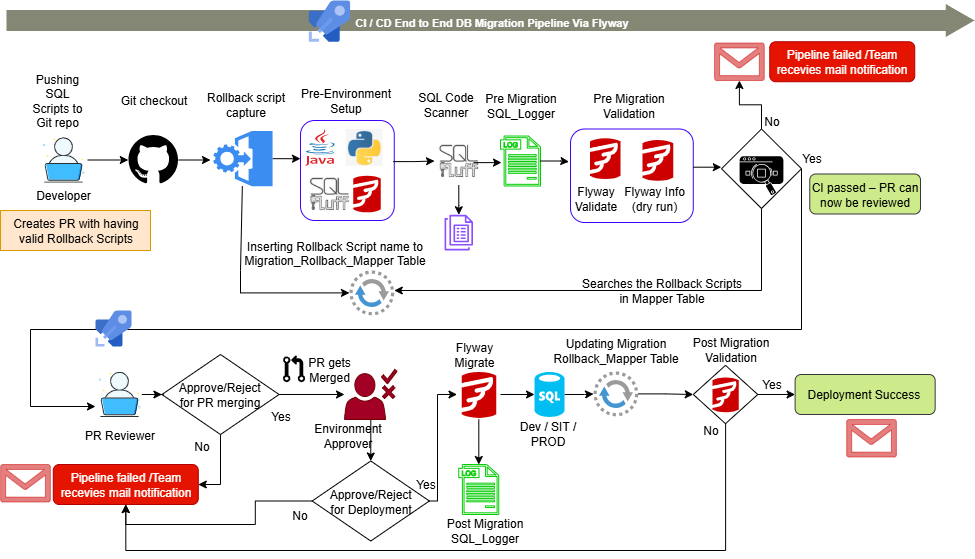

# ✅ DB_Migrotron Documentation

## 👨‍💻 Author
**Teja Surendar Reddy**  
DevOps Engineer | Cloud Enthusiast  
📧 Email: ktsreddy007@gmail.com

---
## 🧾 Overview

**DB_Migrotron** is for the POC of Multi DB migration deployemnt via **Flyway Community Verison** that migrates the existing DB Schema & its data updates successfully with custom rollback logics

---
## Below is the CICD Flow we follow for DB Migration E2E Deployment

   

<table>
    <td>
      <a href="https://drive.google.com/file/d/1YMwuOHT76ThVkOPkw5AjOafuRJ6EcpBG/view?usp=sharing" target="_blank">
        ▶️ Watch the Demo Video
      </a>
    </td>
</table>

---
